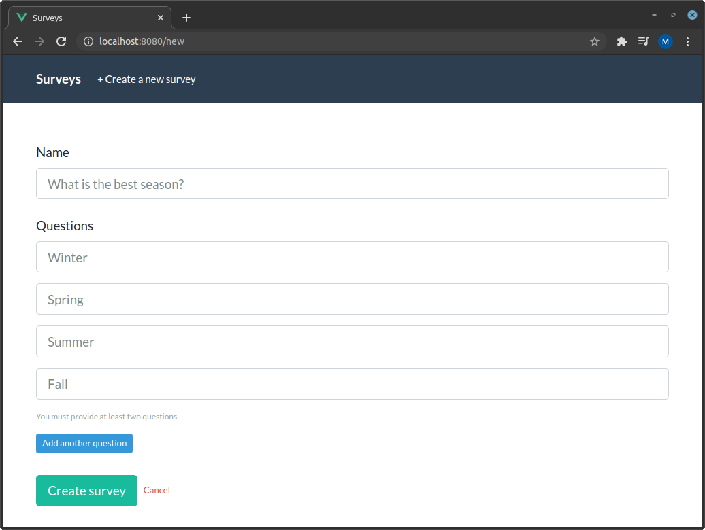
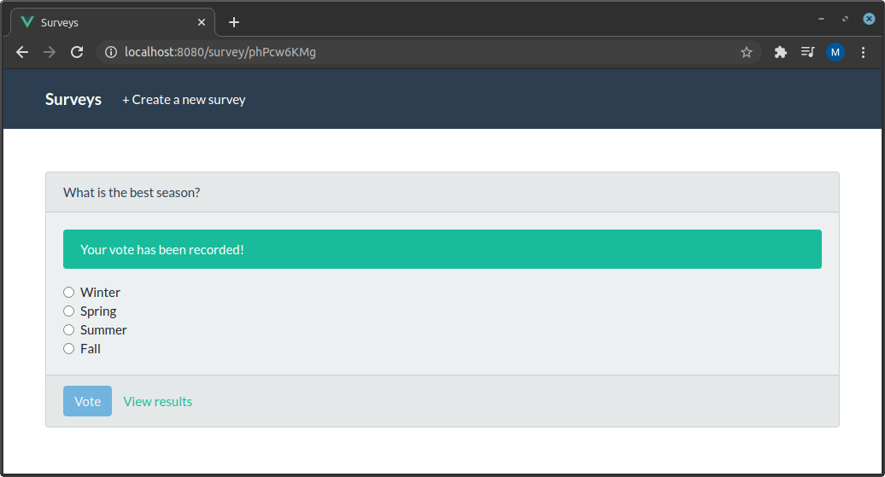
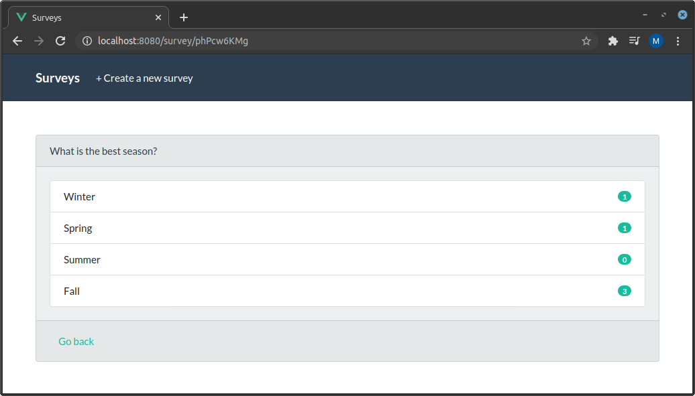

# Microservices Survey App

A distributed survey application implemented as a microservices architecture. The system allows users to create surveys, vote on them, and view results in real-time.


## Architecture Overview

This application is built using a microservices architecture with the following components:

1. **Frontend Service**: Vue.js web application providing user interface for creating surveys, voting, and viewing results.
2. **Survey Service**: Golang service for managing surveys, storing them in MongoDB, and providing survey data via REST and gRPC APIs.
3. **Vote Service**: Golang service for handling votes, forwarding them to a message queue (RabbitMQ), and retrieving vote results from PostgreSQL.
4. **Vote Worker Service**: Golang service that consumes votes from the message queue and persists them in PostgreSQL.
5. **Infrastructure**:
   - MongoDB for survey storage
   - PostgreSQL for vote storage
   - RabbitMQ for vote processing queue

## Main Features

- Create and manage surveys
- Vote on surveys
- View real-time voting results
- Distributed processing of votes

## Key Workflows

### Creating a Survey


### Voting on a Survey


### Viewing Results


## Services Breakdown

### Frontend Service
- Vue.js 2.6 application
- Provides user interface for all app features
- Communicates with backend services via REST APIs

### Survey Service
- Golang service with HTTP and gRPC APIs
- Manages survey creation, retrieval, and listing
- Stores survey data in MongoDB
- Serves as the authoritative source for survey information

### Vote Service
- Golang service with HTTP API
- Validates votes against Survey Service via gRPC
- Publishes valid votes to RabbitMQ queue
- Retrieves voting results from PostgreSQL

### Vote Worker Service
- Golang service
- Consumes votes from RabbitMQ
- Persists votes in PostgreSQL
- Updates vote results in real-time

## Technology Stack

- **Frontend**: Vue.js, Vue Router
- **Backend**: Golang
- **Databases**: 
  - MongoDB (surveys)
  - PostgreSQL (votes and results)
- **Message Queue**: RabbitMQ
- **API Styles**: 
  - REST (HTTP)
  - gRPC (internal service communication)
- **Containerization**: Docker and Docker Compose

## Running the Application

To start the application and all its services:

```bash
docker-compose up
```

The frontend will be available at http://localhost:8080

Individual service endpoints:
- Survey Service: http://localhost:8081
- Vote Service: http://localhost:8082

## Development

Each service can be developed and tested independently. Refer to individual service directories for specific instructions.

## Project Structure

```
├── docker-compose.yml         # Docker Compose configuration
├── frontend-service/          # Vue.js frontend application
├── survey-service/            # Survey management service
├── vote-service/              # Vote handling service
├── vote-worker-service/       # Vote processing worker
├── init/                      # Initialization scripts for databases
└── images/                    # Documentation images
```
